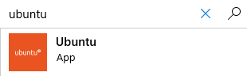

# Cisco Prime Device Facts

A repository for Cisco Prime Device Facts Ansible playbooks using the Cisco Prime API

## Written by John Capobianco, Francois Daigle, and Devin Sloan

## Instructions for Linux users

### Linux prequisites

These playbooks have been developed and tested under Ansble 2.9.1 on CentOS 7.8.2003

You will require Git, Ansible, Node.js 12, and Mark Map

#### Install steps - CentOS

1. Update yum

$ sudo yum -y update

2. Install Ansible

$ sudo yum install epel-release

$ sudo yum install ansible

3. Install node.js 12

$ curl -sL https://rpm.nodesource.com/setup_12.x | sudo bash -

$ sudo yum install -y gcc-c++ make

$ sudo yum install -y nodejs

4. Install Mark Map

$ npm install markmap-lib -g

#### Install steps - Ubuntu

1. Update Ubuntu - this step will take some time. 

$ sudo apt update

$ sudo apt-get upgrade -y

2. Make sure Python is installed.

$ sudo apt-get install python -y

3. Install Ansible.

$ sudo apt-add-repository ppa:ansible/ansible

$ sudo apt-get update

$ sudo apt-get install ansible -y

4. Install node.js

$ sudo apt install npm

5. Install Mark Map 

$ npm install markmap-lib -g

## Instructions for Windows Users

### Windows Prequisites

These playbooks require the Windows Subsystems for Linux and the Ubuntu OS from the Microsoft Store.
Aside from this requirement, the Linux prequisites similarly apply to Windows 10.

#### Install Steps - Windows 10

1. Right-click the Windows Start icon - select Apps and Features.

2. In the Apps and Features window - click Programs and Features under Related Settings on the right side of Apps and Features.

3. Click Turn Windows Features On or Off in the left (with the shield icon) side of the Programs and Features window.

4. Scroll to bottom of the Features window and put a check mark beside Windows Subsytem for Linux; Click Ok and close the open windows.

5. Launch the Microsoft Store.

6. Search for Ubuntu - click the first result.

7. Click Install.

8. Wait for Ubuntu to install.

9. Press Windows Key and start typing Ubuntu - click and launch Ubuntu.

10. The first time Ubuntu launches it has to setup - give this some time.

11. Enter your username and password for Ubuntu.

12. Update Ubuntu - this step will take some time.

$ sudo apt update

$ sudo apt-get upgrade -y

13. Make sure Python is installed.

$ sudo apt-get install python -y

14. Install Ansible.

$ sudo apt-add-repository ppa:ansible/ansible

$ sudo apt-get update

$ sudo apt-get install ansible -y

15. Install node.js.

$ sudo apt install npm

16. Install Mark Map.

$ sudo npm install markmap-lib -g

## Clone the repository

1. git clone https://github.com/automateyournetwork/CiscoPrimeFacts.git

2. Modify the permissions

chmod -R 755 /home/"username"/CiscoPrimeFacts

3. Ubuntu Bug fix

To work around a bug that prevents the Ansible playbook from running on certain versions of Ubuntu please run the following:

sudo mv /usr/bin/sleep /usr/bin/sleep.dist

sudo ln -s /bin/true /usr/bin/sleep

## Prepare your environment

### Enable the Cisco Prime API

Enable Read access for a Prime User

### Modify the group_vars\ENTERPRISE.yml

Update the base URL variable to be your Cisco Prime appliance URL

        api_base_url: "https://x.x.x.x/webacs/api/"

Update the address field with the IP of your Cisco Prime appliance

      address: x.x.x.x

### Modify the hosts file to match your structure

A sample hosts structure has been created and the playbook currently targets all devices under ENTERPRISE

Adjust the scope of your play in the playbooks\CiscoPrimeDeviceFacts.yml to target the group or device you want

    - hosts: ENTERPRISE

## Run the playbook(s)

cd CiscoPrimeFacts/playbooks

### Device Facts - All Hosts in CAMPUS_WAN group

ansible-playbook CiscoPrimeDeviceFacts.yml

### Device Facts - Limited Group or Host

ansible-playbook ansible-playbook CiscoPrimeDeviceFacts.yml --limit "hostname or groupname"

### AP Facts - All Hosts in ACCESS_WAN

ansible-playbook CiscoPrimeAPFacts.yml

### AP Facts - Limited Group or Host

ansible-playbook ansible-playbook CiscoPrimeAPFacts.yml --limit "hostname or groupname"

## Common Errors

Host not in Prime:
fatal: [{{inventory_hostname}}]: FAILED! => {"msg": "The task includes an option with an undefined variable. The error was: 'dict object' has no attribute 'entityId'\n\nThe error appears to be in '/home/usr/Prod-Infrastructure/playbooks/prime/CiscoPrimeDeviceFacts.yml': line 33, column 7, but may\nbe elsewhere in the file depending on the exact syntax problem.\n\nThe offending line appears to be:\n\n# Set Device Fact #\n    - name: Set Device Fact\n      ^ here\n"}

Host does not have Access Points:
fatal: [{{inventory_hostname}}]: FAILED! => {"ansible_facts": {"discovered_interpreter_python": "/usr/bin/python"}, "changed": false, "msg": "Xpath /queryResponse/entityId does not reference a node!"}

## Review the reports

The Reports are stored in CiscoPrimeFacts/documentation.

/json

Contains the RAW JSON output.

/yaml

Contains the RAW YAML output.

/csv

Contains comma separated format.

/markdown

Contains mark down format.

/mindmaps

Contains HTML mind maps best viewed in Google Chrome
